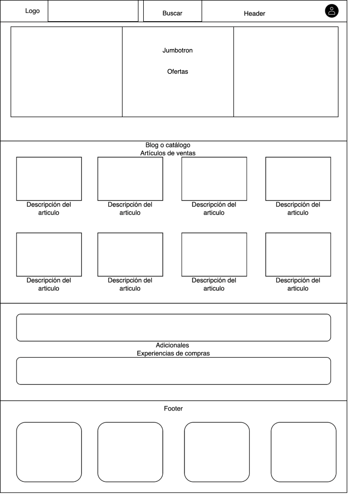
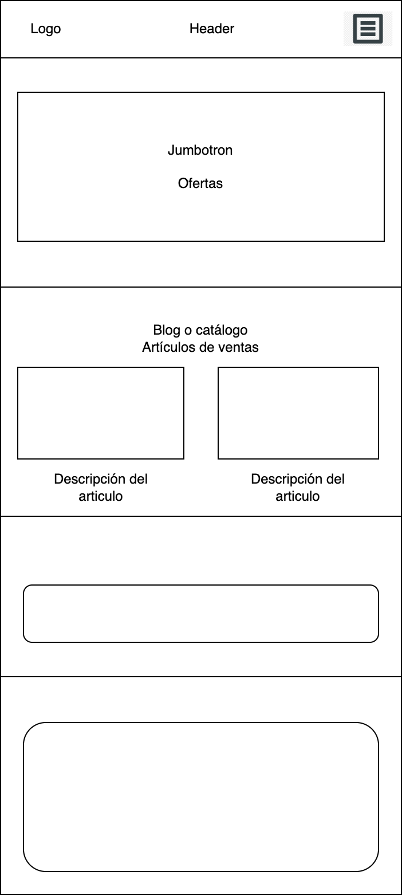

**ESTA ES LA DESCRICIÓN DEL PROYECTO**

#### Contenido
	1. Página de venta de zapatos.

#### Secciones:
	1. Header
	2. Jumbotrom
	3. Catálogo
	4. Adicionales

#### Sub-Sección:
	1. Formulario de registro.

#### Tecnologías utilizadas
	1. HTML
	2. CSS

#### URL proyecto
[Aquí](https://connap.github.io/proyecto-pagina-web)

#### Mockup's
##### Desktop

##### Mobile

#### Agradecimientos  
> Bootcamp UDD
